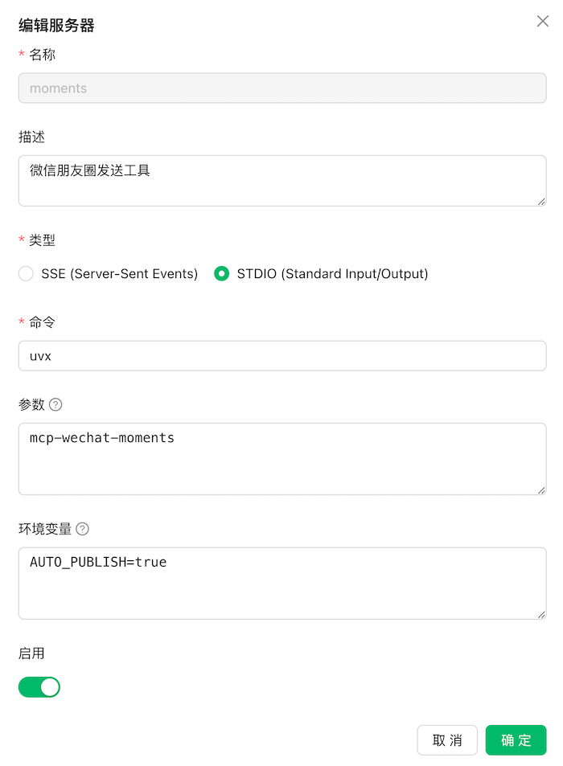

# MCP XiaoAi HASS Server

Use Hass API to control XiaoAi

# Installation

Recommend use `uvx` to setup

## requirements
We need cliclick to emulate mouse click event
> brew install cliclick

Use uvx to install this packages
> uvx mcp-xiaoai-hass

# Configuration & Usage
Use client like Cherry Studio

Environment Variables:
HASS_XIAOAI_ENTITY_ID=media_player.xiaomi_lx05_0ed6_play_control
HASS_TOKEN=home_assistant_token

